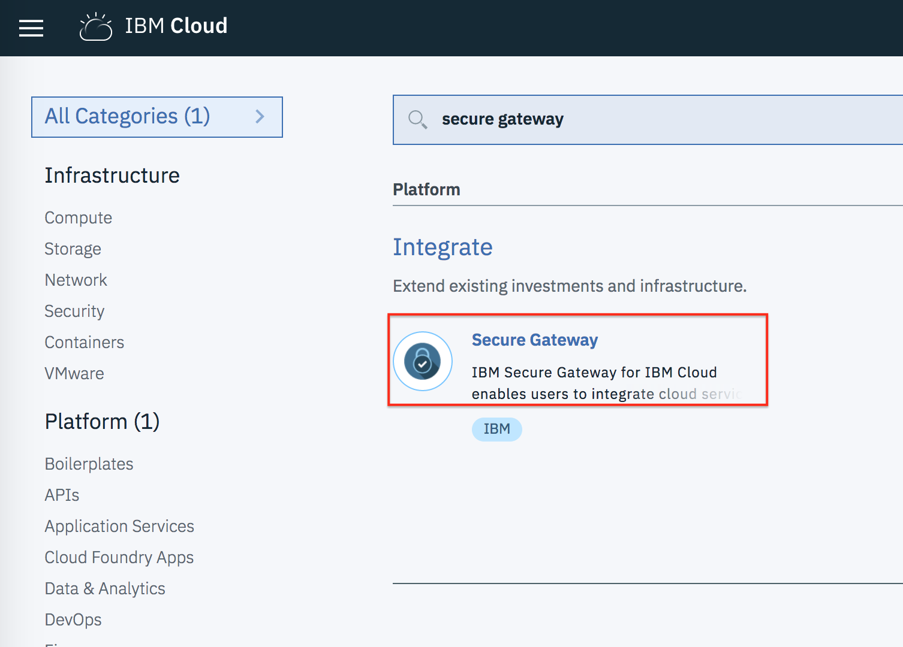
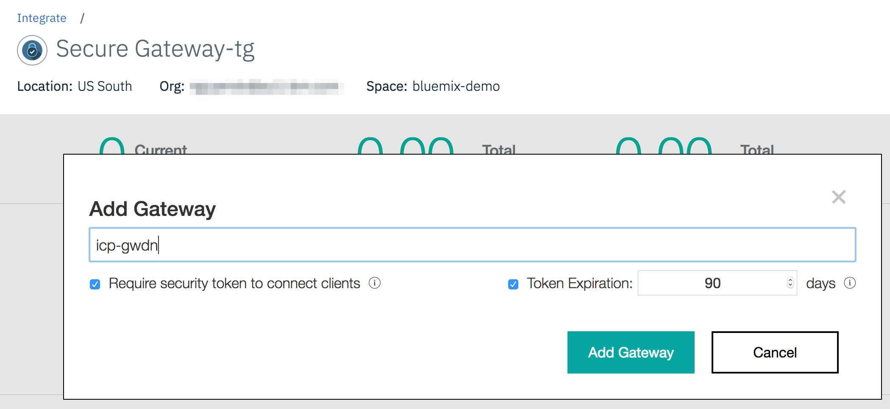
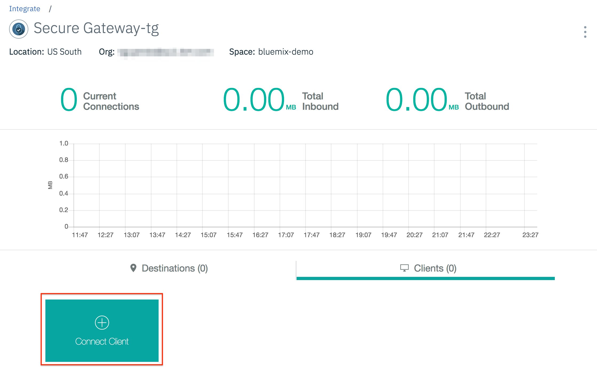
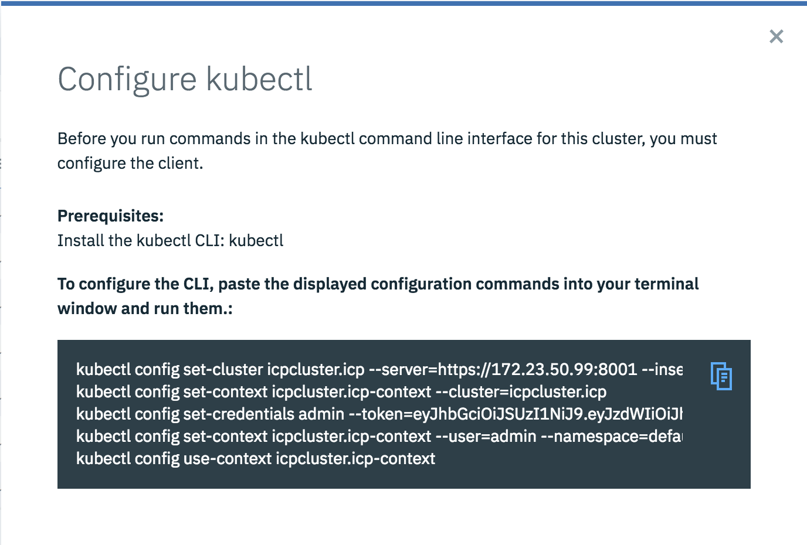
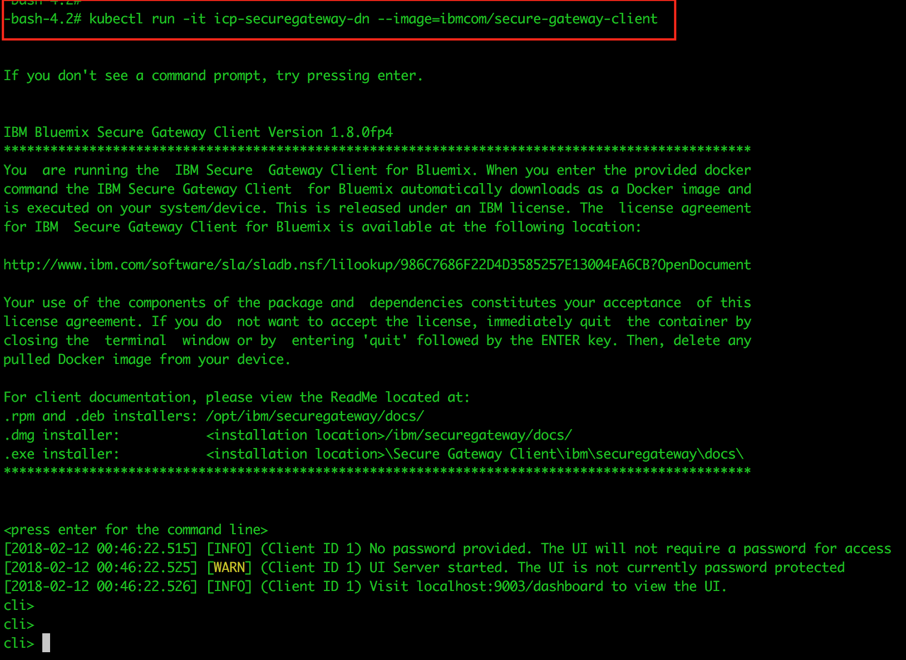
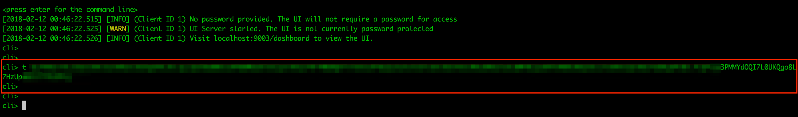
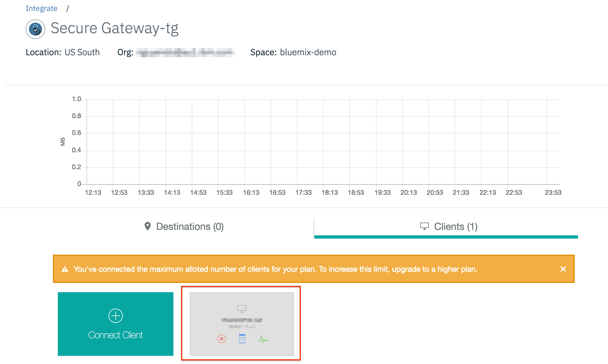
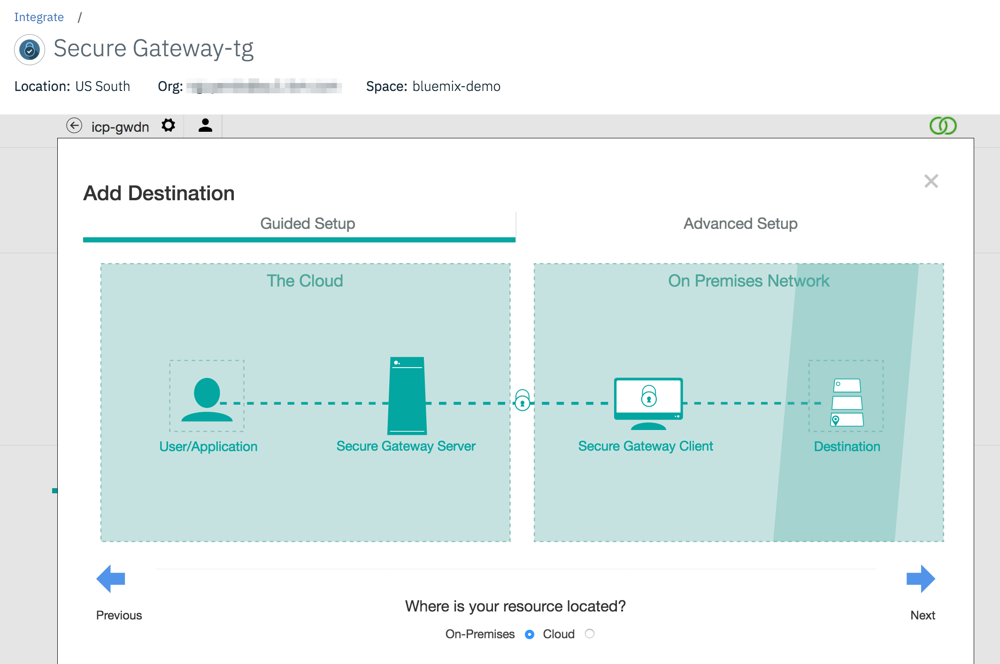
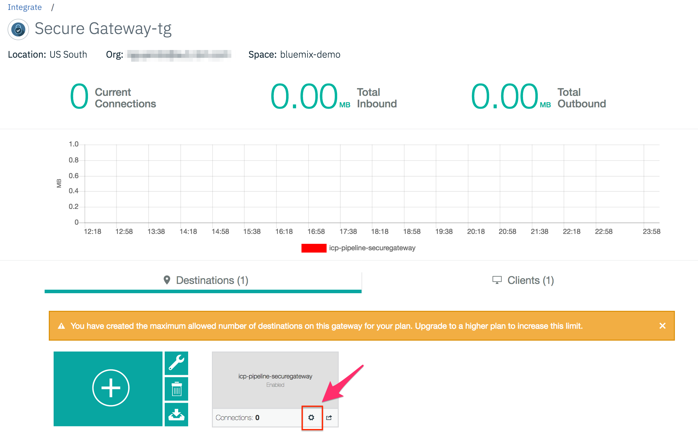

# How to setup a IBM Cloud Secure Gateway for IBM Cloud private

There are multiple cases which you want to expose a service on ICp for an cloud based application to call. One way is to create a VPN channel from the data centre where the application is located to ICp (if the VPN service is available). The other simpler way is to use IBM Secure Gateway on IBM Cloud to securely connect to the ICp service

## How?

**Step 1:** Login to IBM Cloud @ www.bluemix.net

**Step 2:** From the IBM Cloud catalog filter select Secure Gateway


**Step 3:** Select region, org and space you want to deploy the secure gateway, then click 'create'


**Step 4:** After the Secure Gateway is created, it will take you to the secure gateway management page.
Click 'Add Gateway' to start a new gateway


Enter a name for the gateway, the click 'Add gateway'


**Step 5:** Connect to a client. A client container run on ICp will connect to the secure gateway to expose a selected service (destination) to external network. The client requires a gateway ID and security token to start a connection.
Click 'Connect Client' to get the Gateway ID and security token.


**Step 6:** Copy the Gateway ID and Security token


**Step 7:** Start a new terminal, run the ICp 'configure client' commands to authenticate
 
Run the follow `kubectl` command to deploy a new secure gateway client container
```
kubectl run -it icp-secure-gateway-xx --image=ibmcom/secure-gateway-client
```


**Step 8:** from the client cli, set the security token copied on step 6
```
cli> t <SECURITY_TOKEN>
```


Connect to the Gateway ID
```
cli> connect <GATEWAY_ID>
```


**Step 9:** Add service IP:Port to the ACL list
```
cli> acl allow <SERVICE_IP>:<PORT>
```


Close the terminal without exiting the cli

**Step 10:** Go back to the secure gateway management page, you will notice that the client is created


**Step 11:** Add the service on step 9 to the gateway's destination list
Switch to the destination tab, and click '+'


Follow the wizard steps to add the destination



**Step 12:** Your service is publicly available now, click 'settings' of the newly added destination to retrieve the public URL of the service



**Step 13:** To reconnect to your client container, run the following commands:
```
#To get the pod name of the secure gateway
kubectl get pods

kubectl attach -it <POD_NAME>
```
